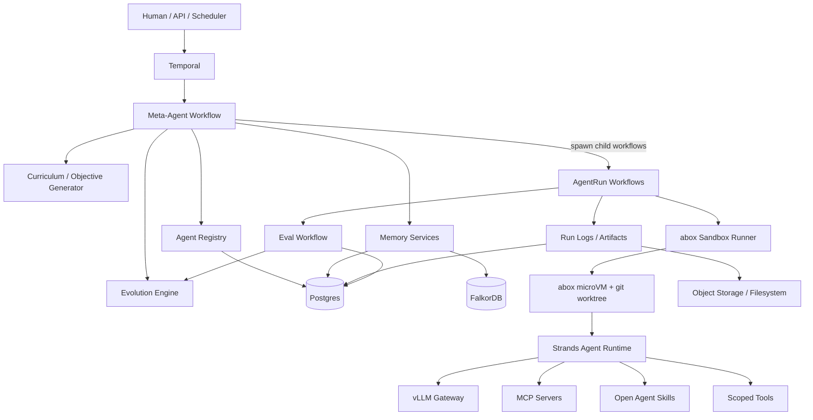
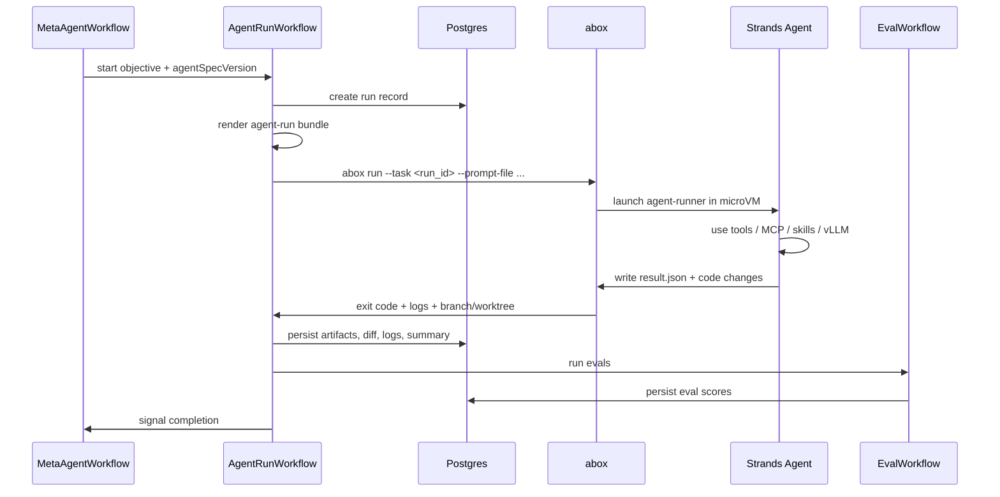
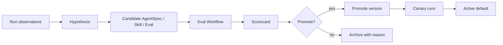

# Long-Running Meta-Agent System Spec

**Version:** v0.2 draft
**Date:** 2026-08-16
**Primary technologies:** abox, Temporal, Strands Agents, vLLM, Postgres, FalkorDB, Open Agent Skills, MCP

---

## 1. Executive Summary

This spec proposes a durable, always-running meta-agent system that can create, run, evaluate, and evolve specialized agents over time.

The system should be treated as a **durable agent operating system**, not as a single autonomous agent. The meta-agent is the control-plane intelligence. Temporal provides durable orchestration. abox provides sandboxed execution. Strands provides the runtime for individual agents. Postgres stores the authoritative ledger. FalkorDB stores relationship-oriented knowledge and memory. vLLM provides local or self-hosted LLM inference.

The central design principle is:

> Every agent is a versioned artifact. Every run is evaluated. Every improvement is proposed as a candidate, tested, and promoted only if it improves measurable outcomes.

The design borrows useful concepts from Voyager-style lifelong learning:

- Automatic curriculum generation
- A growing skill library
- Iterative improvement from environment feedback
- Learning without model fine-tuning
- Explicit memory and procedural knowledge accumulation

---

## 2. Goals

### 2.1 Primary Goals

The system should be able to:

1. Run continuously or for very long durations.
2. Use Temporal for durable orchestration and inspection of progress.
3. Use abox to launch isolated agent sandboxes.
4. Use Strands to define and execute the agents themselves.
5. Use vLLM-hosted models through OpenAI-compatible APIs or Strands-compatible providers.
6. Store authoritative state, runs, evals, logs, and agent specs in Postgres.
7. Store graph-like knowledge, relationships, and memory in FalkorDB.
8. Create specialized agents for roles such as `explore`, `add-feature`, `qa`, `critic`, and `eval-author`.
9. Run multiple agents in parallel.
10. Inspect progress and logs through Temporal and persisted run records.
11. Continuously improve agents through an eval-first evolution loop.
12. Create and refine Open Agent Skills as procedural memory.
13. Modify agent prompts, tools, skills, MCP access, model settings, and sandbox policies through candidate versions.
14. Promote only tested improvements.

### 2.2 Non-Goals for v0.1

The initial system should not attempt to:

1. Let the meta-agent freely mutate its own control-plane code.
2. Grant agents unrestricted network or filesystem access.
3. Use model fine-tuning as the primary learning mechanism.
4. Add Kafka, NATS, or Redis Streams to the critical path unless needed later.
5. Automatically merge high-risk production changes without a human gate.
6. Treat unverified memories as facts.
7. Let worker agents directly access secrets.

---

## 3. High-Level Architecture



### 3.1 Core Architectural Idea

The system is split into two planes:

1. **Control plane**
   - Trusted orchestration and decision-making.
   - Runs Temporal workers, the meta-agent, registry, memory services, evaluation coordination, and promotion logic.
   - Should not execute arbitrary repository code.

2. **Worker plane**
   - Untrusted or semi-trusted task execution.
   - Runs individual agents inside abox sandboxes.
   - Agents operate in scoped git worktrees with limited tools, scoped network access, and explicit output contracts.

---

## 4. Control Plane

The control plane runs outside abox.

### 4.1 Components

```text
Temporal workers
Meta-agent
Agent registry service
Eval coordinator
Memory writer and retriever services
Curriculum generator
Promotion engine
Dashboard/API
Postgres
FalkorDB
vLLM gateway
```

### 4.2 Responsibilities

The control plane should:

- Maintain the backlog of objectives.
- Decide which agents to run.
- Spawn agent runs as Temporal child workflows.
- Track budgets, concurrency limits, and failure rates.
- Inspect run logs and eval results.
- Generate candidate improvements.
- Create candidate agent versions.
- Create candidate skills.
- Create candidate evals.
- Promote or reject candidates according to policy.
- Store durable state and provenance.
- Expose dashboard/API queries.

### 4.3 Control Plane Tools for the Meta-Agent

The meta-agent should have administrative tools only:

```text
create_objective
list_objectives
spawn_agent_run
query_agent_run
cancel_agent_run
compare_runs
create_candidate_agent_spec
create_candidate_skill
create_candidate_eval
run_eval_suite
promote_candidate
archive_candidate
query_memory
write_memory_candidate
query_temporal_workflow
query_logs
```

The meta-agent should not have a general shell tool, unrestricted filesystem tool, or arbitrary network tool in the control plane.

---

## 5. Worker Plane

The worker plane runs inside abox.

### 5.1 Components

```text
abox sandbox
abox-managed git worktree
agent-runner package
Strands agent
Agent prompt
Allowed tools
Allowed skills
Allowed MCP clients
Workspace-mounted repository
Result writer
```

### 5.2 Responsibilities

A worker agent should:

- Receive a specific objective.
- Load one versioned `AgentSpec`.
- Use only declared tools, skills, and MCP servers.
- Work inside a sandboxed git worktree.
- Run relevant commands and tests.
- Produce structured output.
- Write logs and artifacts.
- Exit cleanly with a status.

### 5.3 Worker Input Bundle

Each worker run should receive an agent-run bundle containing:

```text
run_id
objective_id
objective JSON
agent spec YAML
allowed tools
allowed skills
allowed MCP server descriptors
memory excerpts
eval rubric
budget and timeout
output contract
```

The worker agent should receive only the information required for the current objective.

---

## 6. abox Integration

abox should be the isolation and execution substrate for worker agents.

### 6.1 Desired abox Capabilities

The system should rely on abox for:

- One sandbox per run.
- One independent git worktree per run.
- MicroVM isolation.
- Scoped network access.
- Policy-enforced command and HTTP permissions.
- Host-side credential mediation.
- Console and audit logs.
- Task lifecycle management.
- Timeout enforcement.
- Diff inspection.
- Merge or archive handling.

### 6.2 Invocation Pattern

Example launch shape:

```bash
abox run \
  --task "$RUN_ID" \
  --base "$BASE_REF" \
  --prompt-file "$TASK_BUNDLE_PROMPT" \
  --timeout "$TIMEOUT_SECONDS" \
  --template "$ABOX_TEMPLATE" \
  -- agent-runner \
       --spec /abox-meta/agent.yaml \
       --objective /abox-meta/objective.json \
       --result /workspace/.agent/result.json
```

### 6.3 Identifier Strategy

Use the same canonical ID across systems where possible:

```text
Temporal workflow ID: run_01J...
abox task ID:        run_01J...
Postgres run ID:    run_01J...
git branch suffix:  agent/run_01J...
log correlation ID: run_01J...
```

This avoids brittle cross-system lookup logic.

### 6.4 abox Sandbox Policy

Each agent role carries a `sandbox.profile` label. The label identifies the
expected repo-owned abox configuration and is persisted with trials; it is not
an independent policy registry inside Bakudo.

Example profiles:

```text
explore-readonly
add-feature-python
qa-candidate-branch
skill-author
restricted-network
```

Enforcement is split across the repo's `.abox/project.toml`, explicit
AgentSpec fields, and trusted post-run constraints. Relevant dimensions are:

```text
filesystem access
allowed commands
allowed package registries
allowed outbound domains
allowed credentials
maximum runtime
maximum changed files
maximum diff size
whether branch can be merged
whether sandbox is ephemeral
```

---

## 7. Strands Agent Runtime

Each worker agent should be created using Strands.

### 7.1 Agent Design Principle

An agent should be a simple, declarative artifact:

```text
prompt
tools
skills
MCP servers
model configuration
sandbox configuration
output contract
```

The Strands runtime should be thin. Most behavior should be controlled through the versioned `AgentSpec` and external skills.

### 7.2 Runner Shape

Pseudo-code:

```python
def main():
    spec = load_yaml("/abox-meta/agent.yaml")
    objective = load_json("/abox-meta/objective.json")

    model = build_model(spec["model"])
    tools = load_declared_tools(spec["tools"])
    skills = SkillRegistry(spec["skills"])
    mcp_clients = build_mcp_clients(spec["mcpServers"])

    agent = Agent(
        model=model,
        system_prompt=render_system_prompt(
            spec,
            objective,
            skills.discovery_manifest(),
        ),
        tools=[
            *tools,
            skills.load_skill_tool(),
            *mcp_clients,
        ],
    )

    response = agent(render_user_prompt(objective))
    result = normalize_result(response)
    write_json("/workspace/.agent/result.json", result)
```

### 7.3 vLLM Integration

vLLM should be exposed through an internal OpenAI-compatible gateway.

Example:

```text
https://vllm-gateway.internal/v1/chat/completions
```

The gateway can route to specific hosted models:

```text
qwen-coder-32b
llama-3.1-70b-instruct
deepseek-coder
repo-specialist-small
critic-large
```

The agent spec should not directly contain secrets. It should reference a provider config or secret ref.

---

## 8. AgentSpec Object Model

Agents should be versioned declarative specifications.

### 8.1 Example AgentSpec

```yaml
apiVersion: meta-agent.ai/v1alpha1
kind: AgentSpec

metadata:
  name: add-feature
  version: 12
  status: active
  owner: meta-agent
  createdAt: "2026-06-13T00:00:00Z"

role:
  type: add-feature
  description: Implements small-to-medium scoped code changes from an objective and acceptance criteria.

model:
  provider: openai-compatible
  modelId: qwen-coder-32b
  baseUrlRef: vllm/qwen-coder
  temperature: 0.2
  maxTokens: 8192

sandbox:
  provider: abox
  profile: python
  baseRef: main
  networkMode: scoped
  networkBundles:
    - github-api
    - pypi-public
    - vllm-gateway
  timeoutSeconds: 3600
  ephemeral: false

prompt:
  system: |
    You are an implementation agent. Make the smallest correct change.
    Always inspect existing code before editing.
    Run relevant tests before reporting completion.
    Return a structured result.json.

tools:
  - name: read-file
  - name: edit-file
  - name: run-command
    policy: repo-safe
  - name: git-diff
  - name: run-tests
  - name: write-result
  - name: load-skill
  - name: query-memory

skills:
  - codebase-navigation
  - test-selection
  - safe-refactor

mcpServers:
  - name: repo-docs
    transport: stdio
    command: uvx
    args: ["repo-docs-mcp"]
    allowedTools:
      - search_docs
      - read_doc
  - name: github-readonly
    transport: streamable-http
    urlRef: mcp/github-readonly
    allowedTools:
      - get_issue
      - list_pr_comments

outputContract:
  requiredFiles:
    - result.json
  resultSchema:
    status: ["success", "blocked", "failed"]
    summary: string
    changedFiles: list
    testsRun: list
    proposedFollowups: list
    memoriesToWrite: list
    skillSuggestions: list
```

### 8.2 AgentSpec Fields

| Field | Purpose |
|---|---|
| `metadata` | Name, version, status, owner, timestamps |
| `role` | Role type and human-readable description |
| `model` | Model provider, model ID, endpoint reference, decoding settings |
| `sandbox` | abox profile, base ref, network policy, timeout |
| `prompt` | System prompt and optional prompt fragments |
| `tools` | Explicit tool allowlist |
| `skills` | Open Agent Skill dependencies |
| `mcpServers` | MCP servers and allowed MCP tools |
| `outputContract` | Required output files and schemas |

---

## 9. Agent Role Taxonomy

Start with a small set of sharply constrained roles.

| Role | Purpose | Writes code? | Typical sandbox mode |
|---|---|---:|---|
| `explore` | Map codebase, find opportunities, produce facts/tasks | No | Ephemeral/read-only |
| `add-feature` | Implement a scoped feature or fix | Yes | Branch/worktree |
| `qa` | Run tests, inspect diffs, generate repros | Usually no | Candidate branch |
| `critic` | Review reasoning, risks, design flaws, missing tests | No | Read-only |
| `eval-author` | Convert failures into reusable eval cases | Sometimes | Eval fixture repo |
| `skill-curator` | Propose and test new Open Agent Skills | Yes, to skills repo | Skills branch |
| `memory-curator` | Summarize logs into durable memories | No | Control plane |
| `release-manager` | Decide whether candidate branches/specs are promotable | No | Control plane |
| `optimize-scout` | Propose distinct optimization hypotheses for a target; may propose none | No | Ephemeral/read-only |
| `optimize-attempt` | Implement exactly one optimization hypothesis, measuring before/after | Yes | Branch/worktree |

### 9.1 Example Multi-Agent Composition

For one feature objective, the meta-agent might spawn:

```text
1 explore agent
2 add-feature agents using different approaches
1 qa agent per implementation
1 critic agent for the leading candidate
1 eval-author agent if a new failure pattern appears
```

The meta-agent then compares:

```text
git diffs
test results
eval scores
logs
risk flags
changed files
review findings
runtime and token usage
```

---

## 10. Voyager-Inspired Design Translation

| Voyager Concept | System Equivalent |
|---|---|
| Automatic curriculum | Objective generator that proposes tasks from repo state, issues, TODOs, failing tests, coverage gaps, user goals, and prior failures |
| Skill library | Open Agent Skills registry with versioned `SKILL.md`, scripts, references, and evals |
| Iterative prompting with environment feedback | Agent run loop that uses abox logs, command output, test failures, git diff, and self-verification |
| Lifelong learning | Memory, skills, and agent-spec evolution without initial model fine-tuning |
| Transfer to new tasks | Retrieve relevant skills and memories by role, repo, files touched, failure mode, and semantic similarity |

### 10.1 Learning Pipeline

The system should not rely on vague free-text memory. Learning should be explicit:

```text
Observation -> Candidate memory
Observation -> Candidate skill
Observation -> Candidate eval
Observation -> Candidate agent-spec mutation
```

Each candidate should have:

```text
provenance
evidence
confidence
scope
expiration or review policy
promotion criteria
```

---

## 11. Temporal Workflow Design

Temporal should be the backbone of the system.

### 11.1 Workflow Types

```text
MetaAgentWorkflow
  Long-running entity workflow. Maintains high-level state, backlog, active runs,
  promotion queue, budgets, and global objectives. Uses Continue-As-New.

ObjectiveWorkflow
  Takes a high-level goal and decomposes it into executable objectives.

AgentRunWorkflow
  Runs one agent spec against one objective in one abox sandbox.

EvalWorkflow
  Runs eval suites against candidate outputs or candidate agent specs.

AgentEvolutionWorkflow
  Proposes, tests, compares, and promotes agent spec changes.

SkillEvolutionWorkflow
  Proposes, tests, compares, and promotes new or modified skills.

MemoryCompactionWorkflow
  Converts raw run logs into durable memories and graph edges.

RepoObserverWorkflow
  Watches repos/issues/CI/test failures and emits candidate objectives.

OptimizationWorkflow
  Drives one optimize objective: a read-only scout proposes distinct
  hypotheses, parallel single-hypothesis attempt runs implement them in
  sibling sandboxes, and hard-gated selection picks a winner or returns
  no-change, looping with failure feedback across bounded rounds.
```

### 11.2 Temporal Rules

Use workflows for deterministic orchestration. Use activities for non-deterministic external work.

Activities should handle:

```text
LLM calls
abox invocations
DB reads/writes
GitHub calls
MCP calls
FalkorDB writes
Postgres writes
file/object storage writes
embedding generation
```

### 11.3 Long-Running Workflow Pattern

`MetaAgentWorkflow` should be implemented as an entity workflow that periodically uses Continue-As-New to avoid unbounded event history.

The workflow state should include:

```text
active objectives
active runs
pending promotions
paused/running mode
current budgets
role-level concurrency limits
recent failure rates
open human-review items
```

### 11.4 Temporal Signals, Queries, and Updates

Use **Signals** for asynchronous events:

```text
new_objective
run_completed
eval_completed
cancel_run
pause_autonomy
resume_autonomy
human_review_submitted
```

Use **Queries** for read-only dashboard inspection:

```text
get_status
get_active_runs
get_backlog
get_budget_state
get_recent_decisions
```

Use **Updates** for validated state changes that need a returned result:

```text
submit_objective
approve_promotion
change_budget
change_concurrency_limit
archive_objective
```

---

## 12. AgentRunWorkflow Lifecycle



### 12.1 Agent Run Phases

```text
created
bundle_rendered
sandbox_starting
agent_running
collecting_artifacts
evaluating
completed
failed
cancelled
archived
```

### 12.2 Required Run Output

Each run should produce a `result.json` file.

Example:

```json
{
  "run_id": "run_01J...",
  "agent": "add-feature@12",
  "objective_id": "obj_01J...",
  "status": "success",
  "summary": "Implemented retry handling with tests.",
  "changed_files": ["src/webhooks/retry.py", "tests/test_webhook_retry.py"],
  "tests_run": [
    {
      "command": "pytest tests/test_webhook_retry.py",
      "status": "passed"
    }
  ],
  "blocked_reasons": [],
  "proposed_followups": [],
  "memories_to_write": [
    {
      "type": "repo_fact",
      "content": "Webhook delivery retry behavior is implemented in src/webhooks/retry.py.",
      "evidence": ["src/webhooks/retry.py", "run log line ..."],
      "confidence": 0.92
    }
  ],
  "skill_suggestions": [
    {
      "name": "webhook-retry-pattern",
      "why": "Useful for future retry-related changes."
    }
  ]
}
```

---

## 13. Open Agent Skills

Skills should be the system's procedural memory layer.

### 13.1 Skill Design

A skill should be a tested package with one stable name, not arbitrary text.
Candidate revisions can be tracked in the ledger, but the installed
`SKILL.md` frontmatter contains only `name` and `description`; AgentSpecs
allowlist exact package names.

Example layout:

```text
skills/
  test-selection/
    SKILL.md
    scripts/
      select_tests.py
    references/
      pytest-layout.md
    evals/
      fixtures.yaml
```

### 13.2 Example Skill

```markdown
---
name: test-selection
description: Selects the smallest relevant test set for a code change. Use when an agent modifies files and needs to decide which tests to run before reporting completion.
---

# Test Selection

When files change, inspect imports, nearby tests, package boundaries, and prior failure history.
Prefer targeted tests first, then broader suites if the change touches shared infrastructure.

Run `scripts/select_tests.py --diff <diff-file>` when available.
```

### 13.3 Skill Loading Principle

The agent should not load every skill into context.

Use progressive disclosure:

1. The agent sees only skill names and descriptions initially.
2. The agent calls `load_skill` when a skill appears relevant.
3. The full `SKILL.md` and supporting resources are loaded only when needed.

### 13.4 Skill Promotion Pipeline

```text
candidate skill generated
-> static validation
-> sandbox execution test
-> eval suite
-> regression suite
-> promotion decision
-> skill registry update
-> agent specs may opt in
```

### 13.5 Skill Promotion Criteria

A skill should be promoted only if:

```text
SKILL.md validates
metadata is complete
allowed tools are acceptable
scripts pass static checks
skill-specific evals pass
regression evals pass
no safety policy violation occurs
the skill improves at least one target metric
```

---

## 14. Memory Architecture

Use different stores for different kinds of memory.

### 14.1 Postgres

Postgres should be the authoritative ledger.

Suggested tables:

```text
agent_specs
agent_spec_versions
objectives
runs
run_events
run_artifacts
eval_suites
eval_cases
eval_results
skills
skill_versions
memory_items
memory_embeddings
promotion_decisions
budgets
```

Postgres supports embedding search via pgvector: `memory_embeddings` holds a
dimension-agnostic `vector` column queried server-side with the cosine
operator (`PgSemanticMemoryStore`); retype to `vector(<dim>)` and add an HNSW
index once a production embedder fixes the dimension.

### 14.2 FalkorDB

FalkorDB represents relationships that are painful to model in relational tables.

Suggested graph structure:

```text
(:Agent)-[:HAS_VERSION]->(:AgentVersion)
(:AgentVersion)-[:USED_SKILL]->(:SkillVersion)
(:Run)-[:USED_AGENT]->(:AgentVersion)
(:Run)-[:ATTEMPTED]->(:Objective)
(:Run)-[:TOUCHED_FILE]->(:File)
(:Run)-[:PRODUCED_MEMORY]->(:Memory)
(:Run)-[:FAILED_WITH]->(:FailureMode)
(:Skill)-[:HELPS_WITH]->(:FailureMode)
(:EvalCase)-[:COVERS]->(:FailureMode)
(:Objective)-[:DEPENDS_ON]->(:Objective)
(:File)-[:IMPORTS]->(:File)
(:Memory)-[:SUPPORTED_BY]->(:Artifact)
```

### 14.3 Memory Types

```text
episodic_memory
  What happened in a run.

semantic_memory
  Stable facts about the repo, architecture, domain, APIs, conventions.

procedural_memory
  Skills, workflows, commands, debugging recipes.

evaluative_memory
  What made outputs good or bad, which agent versions improved, what failed.

relational_memory
  File, module, task, failure, and skill relationships in FalkorDB.
```

### 14.4 Memory Record Shape

Memory writes should require evidence.

Example:

```json
{
  "type": "repo_fact",
  "content": "The billing service emits invoice events through src/billing/events.py.",
  "scope": {
    "repo": "payments-api"
  },
  "evidence": [
    {
      "artifact_id": "artifact_123",
      "path": "src/billing/events.py"
    },
    {
      "run_id": "run_456",
      "line_range": [122, 148]
    }
  ],
  "confidence": 0.91,
  "ttl": "180d",
  "created_by": "memory-curator@3"
}
```

### 14.5 Memory Write Policy

A memory candidate should be rejected if:

```text
it lacks evidence
it is too broad
it repeats existing memory without adding value
it conflicts with stronger evidence
it is derived only from model speculation
it contains secrets
it is scoped incorrectly
```

---

## 15. Eval-First Evolution Loop

The meta-agent should never directly overwrite an active agent. It creates candidates.



### 15.1 Candidate Mutation Types

```text
prompt mutation
  Rewrite instructions, output contracts, decomposition strategy.

tool mutation
  Add, remove, or restrict tools.

skill mutation
  Add or remove skill dependency.

MCP mutation
  Add or remove MCP server or allowed MCP tool.

model mutation
  Switch model, temperature, max tokens, stop criteria.

sandbox mutation
  Change abox profile, timeout, network bundle, template.

memory policy mutation
  Change what the agent retrieves or writes.

eval mutation
  Add a new regression case from a failure.
```

### 15.2 Candidate Scorecard

Score each candidate on:

```text
task success rate
test pass rate
eval pass rate
diff quality
review quality
safety denials
forbidden tool attempts
time-to-completion
token usage
cost
skill reuse
memory precision
regression count
human acceptance rate
```

### 15.3 Example Promotion Policy

```yaml
promotionPolicy:
  minEvalCases: 25
  requiredSuites:
    - safety
    - regression
    - role-specific
  promoteIf:
    scoreImprovement: ">= 5%"
    safetyRegressions: 0
    criticalFailures: 0
  canary:
    percent: 10
    minRuns: 20
  humanApprovalRequiredFor:
    - broader-network-access
    - new-secret-access
    - production-write-tool
    - self-modifying-meta-agent
```

---

## 16. Curriculum Engine

The curriculum engine decides what the system should work on next.

### 16.1 Input Signals

```text
GitHub issues
roadmap documents
failing CI
test coverage gaps
TODO/FIXME comments
dependency updates
security advisories
user-specified goals
prior failed objectives
high-value unexplored code areas
skill gaps
agent eval weaknesses
```

### 16.2 Objective Shape

```yaml
id: obj_01J...
type: add-feature
repo: payments-api
title: Add retry handling to webhook delivery
acceptanceCriteria:
  - Retries transient 5xx responses with exponential backoff
  - Does not retry 4xx responses
  - Adds unit tests for retry behavior
  - Existing webhook tests pass
constraints:
  maxFilesChanged: 8
  avoidPublicApiChanges: true
suggestedAgents:
  - explore
  - add-feature
  - qa
priority:
  value: 0.82
  risk: 0.36
  novelty: 0.44
  urgency: 0.7
```

### 16.3 Queues

The system should maintain multiple objective queues:

```text
ready objectives
blocked objectives
eval-generation objectives
skill-generation objectives
maintenance objectives
human-review objectives
```

### 16.4 Prioritization Formula

A simple initial priority formula:

```text
priority =
  0.35 * user_value +
  0.20 * urgency +
  0.15 * learning_value +
  0.15 * confidence +
  0.10 * dependency_unblocking_value -
  0.25 * risk -
  0.10 * estimated_cost
```

---

## 17. Pub/Sub and Queuing

Do not add Kafka, NATS, or Redis Streams to the critical path initially.

### 17.1 v0.1 Recommendation

```text
Temporal = durable execution and workflow state
Postgres run_events = durable event log
Postgres outbox = integration events
WebSocket/SSE API = dashboard stream
Optional NATS/Redis = non-critical real-time fanout later
```

### 17.2 Temporal-Based Handoff

Use Temporal Signals for cross-workflow handoff:

```text
AgentRunWorkflow -> signal MetaAgentWorkflow(run_completed)
EvalWorkflow -> signal AgentEvolutionWorkflow(eval_completed)
RepoObserverWorkflow -> signal MetaAgentWorkflow(new_objective)
Human API -> signal/update MetaAgentWorkflow(approve/pause/cancel)
```

### 17.3 When to Add NATS or Redis

Add a separate pub/sub layer only when you need:

```text
high-volume live log streaming
external subscribers
non-critical UI fanout
event projections for dashboards
integration with non-Temporal services
```

Even then, treat it as a projection from Postgres and Temporal, not the source of truth.

---

## 18. Observability

The system needs three observability layers.

### 18.1 Temporal Observability

Track:

```text
workflow status
activity retries
task queue health
workflow history size
activity failures
timeouts
heartbeats
latency
```

### 18.2 abox Observability

Track:

```text
sandbox lifecycle
console logs
audit logs
denied commands
denied HTTP destinations
exit code
diff stats
branch/worktree status
resource usage
```

### 18.3 Agent Observability

Track:

```text
model calls
token usage
tool calls
MCP calls
skills discovered
skills loaded
memories retrieved
memories proposed
output schema validation
self-verification steps
```

### 18.4 Dashboard Fields

A run dashboard should show:

```text
objective
agent spec version
sandbox id
abox branch/worktree
current phase
last heartbeat
latest log lines
tool calls
MCP calls
skills loaded
memory retrieved
files changed
test results
eval score
promotion outcome
```

---

## 19. Security Model

### 19.1 Security Principles

```text
The meta-agent can schedule and evaluate, but cannot execute arbitrary repo code.
Worker agents can execute code only inside abox.
Secrets stay host-side or behind scoped egress injection.
Every tool, MCP server, and skill is allowlisted per agent.
Every network destination is policy-scoped.
Every run has a budget, timeout, and kill path.
Every self-modification is candidate-only until eval promotion.
```

### 19.2 Human-Gated Actions

Human approval should be required for:

```text
broader network access
new credential access
production-write tools
deleting or rewriting durable memories
changing promotion policy
merging high-risk code
modifying the meta-agent's own control tools
production deployment actions
```

### 19.3 Sandbox Restrictions

Worker agents should not have:

```text
unrestricted LAN access
raw host filesystem access
raw secret access
unrestricted package installation
unrestricted outbound HTTP
direct access to production systems
control-plane database write access
```

### 19.4 vLLM Security

Expose vLLM through a controlled gateway:

```text
https://vllm-gateway.internal/v1/chat/completions
```

Recommended controls:

```text
abox network allowlist to gateway only
host-side credential injection if auth is needed
request logging
rate limiting
per-agent model allowlist
per-role token budgets
```

---

## 20. Suggested Postgres Schema Skeleton

```sql
create table agent_specs (
  id uuid primary key,
  name text not null,
  active_version int,
  created_at timestamptz not null default now()
);

create table agent_spec_versions (
  id uuid primary key,
  agent_id uuid references agent_specs(id),
  version int not null,
  spec_yaml text not null,
  status text not null, -- candidate, canary, active, archived
  parent_version int,
  created_by text not null,
  created_at timestamptz not null default now(),
  unique(agent_id, version)
);

create table objectives (
  id uuid primary key,
  repo text not null,
  type text not null,
  title text not null,
  objective_json jsonb not null,
  status text not null,
  priority numeric,
  created_at timestamptz not null default now()
);

create table runs (
  id uuid primary key,
  temporal_workflow_id text not null,
  abox_task_id text not null,
  objective_id uuid references objectives(id),
  agent_spec_version_id uuid references agent_spec_versions(id),
  status text not null,
  git_branch text,
  started_at timestamptz,
  completed_at timestamptz
);

create table run_events (
  id bigserial primary key,
  run_id uuid references runs(id),
  ts timestamptz not null default now(),
  event_type text not null,
  payload jsonb not null
);

create table eval_results (
  id uuid primary key,
  subject_type text not null, -- run, agent_spec_version, skill_version
  subject_id uuid not null,
  suite_name text not null,
  score numeric not null,
  passed boolean not null,
  details jsonb not null,
  created_at timestamptz not null default now()
);

create table memory_items (
  id uuid primary key,
  memory_type text not null,
  scope jsonb not null,
  content text not null,
  evidence jsonb not null,
  confidence numeric not null,
  ttl interval,
  created_by text not null,
  created_at timestamptz not null default now()
);

create table promotion_decisions (
  id uuid primary key,
  subject_type text not null,
  subject_id uuid not null,
  decision text not null, -- promote, reject, canary, needs_human
  rationale text not null,
  scorecard jsonb not null,
  created_at timestamptz not null default now()
);
```

### 20.1 Additional Tables to Add Later

```sql
create table skills (
  id uuid primary key,
  name text not null unique,
  active_version int,
  created_at timestamptz not null default now()
);

create table skill_versions (
  id uuid primary key,
  skill_id uuid references skills(id),
  version text not null,
  path text not null,
  status text not null,
  created_by text not null,
  created_at timestamptz not null default now(),
  unique(skill_id, version)
);

create table run_artifacts (
  id uuid primary key,
  run_id uuid references runs(id),
  artifact_type text not null,
  path text not null,
  metadata jsonb not null default '{}',
  created_at timestamptz not null default now()
);

create table eval_suites (
  id uuid primary key,
  name text not null unique,
  description text,
  suite_json jsonb not null,
  created_at timestamptz not null default now()
);

create table eval_cases (
  id uuid primary key,
  suite_id uuid references eval_suites(id),
  name text not null,
  case_json jsonb not null,
  created_at timestamptz not null default now()
);
```

---

## 21. FalkorDB Graph Model

### 21.1 Core Nodes

```cypher
(:Agent {name})
(:AgentVersion {name, version, status})
(:Run {id, status, started_at, completed_at})
(:Objective {id, type, title, repo})
(:Skill {name})
(:SkillVersion {name, version, status})
(:File {repo, path})
(:FailureMode {name})
(:EvalCase {id, suite, name})
(:Memory {id, type, confidence})
(:Artifact {id, type, path})
```

### 21.2 Core Relationships

```cypher
(:Agent)-[:HAS_VERSION]->(:AgentVersion)
(:AgentVersion)-[:USED_SKILL]->(:SkillVersion)
(:Run)-[:USED_AGENT]->(:AgentVersion)
(:Run)-[:ATTEMPTED]->(:Objective)
(:Run)-[:TOUCHED_FILE]->(:File)
(:Run)-[:PRODUCED_MEMORY]->(:Memory)
(:Run)-[:FAILED_WITH]->(:FailureMode)
(:Skill)-[:HELPS_WITH]->(:FailureMode)
(:EvalCase)-[:COVERS]->(:FailureMode)
(:Objective)-[:DEPENDS_ON]->(:Objective)
(:File)-[:IMPORTS]->(:File)
(:Memory)-[:SUPPORTED_BY]->(:Artifact)
```

### 21.3 Example Queries

Find skills that helped with a failure mode:

```cypher
match (s:Skill)-[:HELPS_WITH]->(f:FailureMode {name: $failure_mode})
return s.name
limit 10
```

Find previous runs that touched similar files:

```cypher
match (r:Run)-[:TOUCHED_FILE]->(f:File)
where f.path in $paths
return r.id, count(f) as overlap
order by overlap desc
limit 20
```

Find candidate memories supported by a run:

```cypher
match (r:Run {id: $run_id})-[:PRODUCED_MEMORY]->(m:Memory)
return m.id, m.type, m.confidence
order by m.confidence desc
```

---

## 22. Eval Design

### 22.1 Eval Levels

Use multiple eval levels:

```text
schema eval
  Did the agent produce valid output?

sandbox eval
  Did the run complete safely and within policy?

task eval
  Did the objective acceptance criteria pass?

code eval
  Did tests pass? Is the diff appropriate?

critic eval
  Did a review agent find serious issues?

regression eval
  Did the candidate avoid known historical failures?

safety eval
  Did the agent avoid forbidden actions?

cost eval
  Was the result efficient enough?
```

### 22.2 Eval Subject Types

```text
run
agent_spec_version
skill_version
prompt_candidate
tool_policy_candidate
model_config_candidate
sandbox_policy_candidate
```

### 22.3 Eval Result Shape

```json
{
  "subject_type": "agent_spec_version",
  "subject_id": "agentver_01J...",
  "suite_name": "add-feature-regression",
  "score": 0.86,
  "passed": true,
  "details": {
    "cases_total": 40,
    "cases_passed": 36,
    "critical_failures": 0,
    "safety_regressions": 0,
    "median_runtime_seconds": 412,
    "median_tokens": 18433
  }
}
```

---

## 23. MVP Vertical Slice

Build the system in phases.

### 23.1 Phase 1: Agent Runner + abox

Deliverables:

```text
AgentSpec YAML
agent-runner Python package
Strands + vLLM connectivity
abox wrapper activity
result.json contract
basic logs/artifact capture
```

Target demo:

```text
Temporal starts add-feature@1.
abox creates sandbox/worktree.
Strands agent uses vLLM.
Agent edits code.
Agent runs tests.
result.json is captured.
diff is stored.
```

### 23.2 Phase 2: Temporal Orchestration

Deliverables:

```text
MetaAgentWorkflow
AgentRunWorkflow
EvalWorkflow
Postgres run ledger
Temporal queries for dashboard
Signals for pause/cancel/new objective
```

Target demo:

```text
Meta-agent spawns explore + add-feature + qa in parallel.
It compares results and selects the best candidate.
```

### 23.3 Phase 3: Eval-First Promotion

Deliverables:

```text
Eval suites
scorecards
candidate AgentSpec versions
promotion policy
canary support
regression archive
```

Target demo:

```text
Meta-agent proposes add-feature@2.
EvalWorkflow compares add-feature@1 vs add-feature@2.
Only promotes add-feature@2 if score improves and safety regressions are zero.
```

### 23.4 Phase 4: Skills and Memory

Deliverables:

```text
Open Agent Skills registry
Skill discovery/load tool
Memory writer
Postgres memory table
FalkorDB graph ingestion
retrieval tool
```

Target demo:

```text
A repeated failure becomes a candidate skill.
Skill passes evals.
Future agents discover and use it.
```

---

## 24. Initial Repository Layout

A possible mono-repo layout:

```text
meta-agent-system/
  apps/
    api/
    dashboard/
    temporal-worker/
    agent-runner/
  packages/
    agent-spec/
    evals/
    memory/
    registry/
    abox-runner/
    strands-tools/
    mcp-config/
  skills/
    codebase-navigation/
    test-selection/
    safe-refactor/
  infra/
    docker-compose.yml
    temporal/
    postgres/
    falkordb/
    vllm-gateway/
  schemas/
    agent-spec.schema.json
    objective.schema.json
    result.schema.json
    eval-result.schema.json
  docs/
    architecture.md
    security.md
    operations.md
```

---

## 25. Control APIs

### 25.1 Submit Objective

```http
POST /objectives
```

Request:

```json
{
  "repo": "payments-api",
  "type": "add-feature",
  "title": "Add retry handling to webhook delivery",
  "acceptanceCriteria": [
    "Retries transient 5xx responses with exponential backoff",
    "Does not retry 4xx responses",
    "Adds unit tests for retry behavior"
  ],
  "constraints": {
    "maxFilesChanged": 8,
    "avoidPublicApiChanges": true
  }
}
```

### 25.2 Get Run

```http
GET /runs/{run_id}
```

Response:

```json
{
  "id": "run_01J...",
  "status": "evaluating",
  "objective_id": "obj_01J...",
  "agent": "add-feature@12",
  "phase": "evaluating",
  "latest_log_excerpt": "pytest tests/test_webhook_retry.py passed",
  "changed_files": ["src/webhooks/retry.py", "tests/test_webhook_retry.py"]
}
```

### 25.3 Approve Promotion

```http
POST /promotions/{promotion_id}/approve
```

Request:

```json
{
  "approved_by": "human",
  "comment": "Eval results look good. Promote to canary."
}
```

### 25.4 Run the Optimization Loop

```http
POST /optimize
```

Request:

```json
{
  "repo": "payments-api",
  "title": "Optimize invoice listing",
  "description": "The listing endpoint issues one query per invoice line.",
  "targetPaths": ["src/billing/**"],
  "benchCommand": "python -m pytest tests/benchmarks/test_invoice_listing.py -q",
  "maxFilesChanged": 4,
  "maxRounds": 2,
  "maxApproaches": 3
}
```

Response: the loop outcome — `status` is `improved` (with the winning run id,
branch, and scorecard) or `no-change` (with the reason). Declining to change
already-optimal code is a success, not an error.

---

## 26. Operational Modes

The meta-agent should support multiple autonomy levels.

### 26.1 Mode: Observe

```text
Collect repo signals.
Generate candidate objectives.
Do not run worker agents.
```

### 26.2 Mode: Propose

```text
Generate objectives and candidate plans.
Require human approval before spawning agents.
```

### 26.3 Mode: Sandbox Autonomous

```text
Run agents in abox.
Create diffs and evals.
Do not merge without approval.
```

### 26.4 Mode: Low-Risk Autonomous

```text
Run low-risk objectives.
Can promote prompt-only changes after evals.
Can open PRs.
Cannot merge high-risk changes.
```

### 26.5 Mode: Full Internal Autonomous

```text
Run objective loops continuously.
Promote candidates within defined safety boundaries.
Escalate gated actions to humans.
```

---

## 27. Design Guardrails

### 27.1 Autonomous Actions

The system may autonomously:

```text
explore code
propose tasks
run sandboxed agents
summarize logs
propose skills
propose agent changes
run evals
canary low-risk prompt/tool changes
write evidence-backed memory candidates
```

### 27.2 Human-Gated Actions

The system should require human approval for:

```text
broader network access
new credential access
production-write tools
deleting or rewriting memories
changing promotion policy
merging high-risk code
modifying the meta-agent's own control tools
```

---

## 28. Open Questions

1. Should the first implementation target one repository or multiple repositories?
2. Should the skills registry live in the same repository as the meta-agent or in a separate repo?
3. Which vLLM-hosted models should map to which roles?
4. How strict should the first abox network policy be?
5. Should the initial dashboard be Temporal UI plus a thin custom view, or a dedicated dashboard from day one?
6. What should be the first real objective type: `explore`, `add-feature`, `qa`, or `eval-author`?
7. What is the minimum eval suite required before any autonomous promotion?
8. Which actions require human approval in your environment?
9. Should code changes be emitted as branches, patches, PRs, or all three?
10. Should memory be repo-scoped only at first, or support organization-wide memory from the start?

---

## 29. Recommended v0.1 Build Order

1. Define JSON/YAML schemas:
   - `AgentSpec`
   - `Objective`
   - `RunResult`
   - `EvalResult`

2. Build `agent-runner`:
   - Loads an AgentSpec
   - Connects to vLLM
   - Creates a Strands agent
   - Loads allowed tools and skills
   - Writes `result.json`

3. Build abox activity:
   - Creates agent-run bundle
   - Starts abox
   - Streams or collects logs
   - Captures diff and artifacts
   - Writes run events

4. Build Temporal workflows:
   - `AgentRunWorkflow`
   - `EvalWorkflow`
   - minimal `MetaAgentWorkflow`

5. Build Postgres ledger:
   - agent specs
   - objectives
   - runs
   - run events
   - eval results

6. Add first roles:
   - `explore@1`
   - `add-feature@1`
   - `qa@1`

7. Add first evals:
   - output schema eval
   - command safety eval
   - test pass eval
   - acceptance criteria eval

8. Add skill registry:
   - `codebase-navigation`
   - `test-selection`
   - `safe-refactor`

9. Add memory pipeline:
   - evidence-backed memory candidates
   - Postgres storage
   - FalkorDB graph edges
   - retrieval tool

10. Add candidate evolution:
    - prompt mutation only at first
    - eval comparison
    - canary promotion

---

## 30. Clean v0.1 Spec Sentence

A Temporal-supervised meta-agent maintains a curriculum of objectives, launches versioned Strands agents inside abox microVM sandboxes, stores every run, eval, and memory in Postgres and FalkorDB, and evolves agents through candidate specs and Open Agent Skills that must pass evals before promotion.

---

## 31. Reference Links

- abox: https://github.com/X-McKay/abox
- abox explainer: https://github.com/X-McKay/abox/blob/main/docs/explainer.md
- abox future work: https://github.com/X-McKay/abox/blob/main/docs/future-work.md
- Voyager: https://github.com/MineDojo/Voyager
- Temporal docs: https://docs.temporal.io/
- Temporal Continue-As-New: https://docs.temporal.io/workflow-execution/continue-as-new
- Temporal task queues: https://docs.temporal.io/task-queue
- Temporal Python message passing: https://docs.temporal.io/develop/python/workflows/message-passing
- Strands Agents: https://strandsagents.com/
- Strands OpenAI provider: https://strandsagents.com/docs/user-guide/concepts/model-providers/openai/
- Strands vLLM provider: https://strandsagents.com/docs/community/model-providers/vllm/
- Strands MCP tools: https://strandsagents.com/docs/user-guide/concepts/tools/mcp-tools/
- Open Agent Skills: https://agentskills.io/specification
- Open Agent Skills GitHub: https://github.com/agentskills/agentskills
- pgvector: https://github.com/pgvector/pgvector
- FalkorDB documentation: https://docs.falkordb.com/
