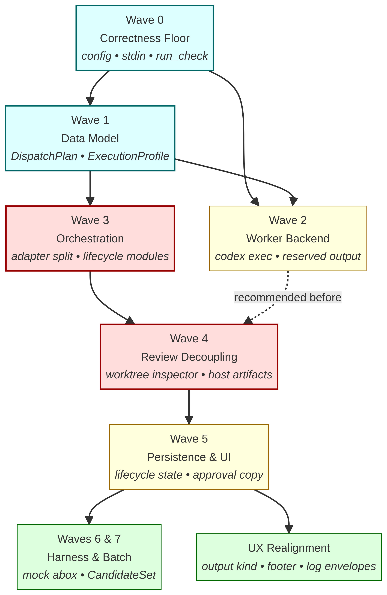

# Bakudo Control-Plane Realignment — Plan Set

This directory contains the complete, junior-engineer-proof implementation plan set for realigning bakudo with the [2026-04-19 control-plane spec](../2026-04-19-bakudo-abox-control-plane-spec.md). It is designed to allow a team of engineers (or parallel agents) to safely execute a 12,000+ line refactor across 8 waves without breaking `main`.

## Document Map

| Document | Purpose |
| :--- | :--- |
| [`00-execution-overview.md`](00-execution-overview.md) | Master plan: phasing, dependencies, parallelism, hand-off criteria, risk |
| [`waves/01-wave-0-correctness.md`](waves/01-wave-0-correctness.md) | Config resolution, stdin pipeline, `run_check` fix, lifecycle wording |
| [`waves/02-wave-1-data-model.md`](waves/02-wave-1-data-model.md) | `DispatchPlan`, `ExecutionProfile`, planner routing, session record migration |
| [`waves/03-wave-2-worker-backend.md`](waves/03-wave-2-worker-backend.md) | `codex exec` backend, reserved guest output directory |
| [`waves/04-wave-3-orchestration.md`](waves/04-wave-3-orchestration.md) | Split `aboxAdapter` into `sandboxLifecycle` + `worktreeDiscovery` + `mergeController`; remove `BAKUDO_EPHEMERAL` and `executeTask` |
| [`waves/05-wave-4-review-decoupling.md`](waves/05-wave-4-review-decoupling.md) | `worktreeInspector`, host-generated artifacts, decoupled review pipeline |
| [`waves/06-wave-5-persistence-ui.md`](waves/06-wave-5-persistence-ui.md) | Lifecycle persistence in `SessionAttemptRecord`, approval copy, inspect tabs |
| [`waves/07-waves-6-7-harness-batch.md`](waves/07-waves-6-7-harness-batch.md) | Mock abox harness, integration tests, `CandidateSet` & `BatchSpec` types |
| [`waves/08-ux-realignment.md`](waves/08-ux-realignment.md) | `output` transcript kind, footer hints, log v2 envelope rendering, golden regeneration |
| [`dependency-graph.png`](dependency-graph.png) | Visual dependency graph of the waves |

## Dependency Graph

**Legend:**
- **Blue (W0, W1):** Foundational, must land first.
- **Red (W3, W4):** High-risk structural refactors on the critical path.
- **Yellow (W2, W5):** Medium-risk waves that can run in parallel with the critical path.
- **Green (W6/W7, UX):** Lower-risk waves that depend on W5.

## How to Use This Set

1. **Start here.** Read [`00-execution-overview.md`](00-execution-overview.md) end to end. It explains the phasing strategy, the parallelism opportunities, and the hand-off criteria.
2. **Pick a wave.** Each wave document is fully self-contained: pre-reads, vocabulary, dependencies, file lists (delete/add/modify), step-by-step code, test strategy, acceptance criteria, rollback notes.
3. **Follow the wave.** The code examples are real and tested against the current architecture. Do not deviate. If you discover a deviation is necessary, write an ADR before proceeding.
4. **Verify acceptance.** Each wave specifies exactly what must be true before merging. Don't merge a wave that doesn't meet its criteria.
5. **Update the progress log.** After landing a wave, append to [`../2026-04-19-implementation-progress.md`](../2026-04-19-implementation-progress.md) so the next engineer or agent has clean continuity.

## Scope and Reasoning

The 7-wave structure intentionally sequences high-risk structural refactors (W3, W4) **after** the foundational data-model work (W1) so the type system can guide the refactor. The UX Realignment is held until **after** Wave 5 so that the rendering layer binds to the final vocabulary instead of an intermediate version.

A few important design notes:

The **decoupling of execution from review** in Wave 4 is the most important architectural change in the realignment. The current code base treats the worker's `exit_code` as the verdict, which is fundamentally misaligned with bakudo's purpose: the verdict is the **state of the worktree**. The worktree inspector generates host-owned artifacts (`patch.diff`, `changed-files.json`) so reviews are based on what actually happened in the repo, not on agent stdout.

The **deletion of legacy code** (`WorkerTaskSpec`, `executeTask`, `BAKUDO_EPHEMERAL`, the `claude --print` runner, the prose-only `assistant_job` runner) is mandatory in the corresponding waves. There is no deprecation period. The user's directive was to keep the codebase clean and easy to maintain; preserving these would split the system's behavior.

The **UX realignment** intentionally lands last so that the rendering layer can bind to the new sandbox-state and merge-strategy fields directly, without needing intermediate adapters. This makes the final TUI feel native to the new control-plane vocabulary rather than retrofitted on top of it.

## After Implementation

Once all waves are complete, the AGENTS.md files should be updated to reflect the new architecture. The `2026-04-18-integration-roadmap.md` and `2026-04-19-bakudo-abox-control-plane-implementation-plan.md` documents should be archived (moved to `plans/archive/`) since they will have been superseded by the realized implementation. The `2026-04-19-bakudo-abox-control-plane-spec.md` should remain as the canonical reference for the control-plane design.
